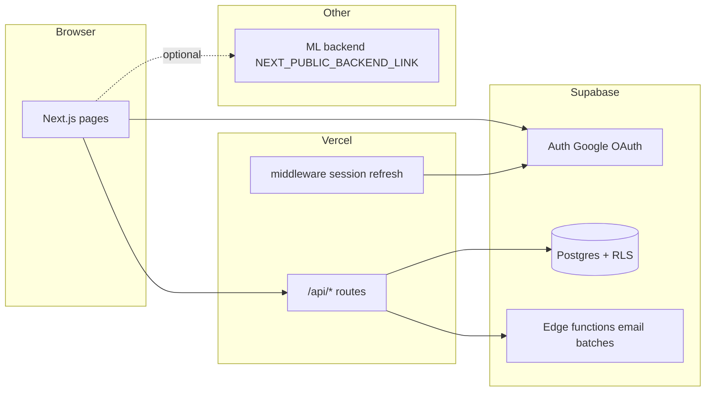

# Platform overview

PICKUP helps students coordinate airport rides (often ASPC-subsidized). This repo is the **Next.js web app**; matching logic and bulk email sending live partly in **Supabase** (Postgres + edge functions) and partly in a **separate ML/backend** service.

## High-level architecture

| Layer | Role |
|-------|------|
| **Pages** (`src/app/**/page.tsx`) | UI: questionnaires, results, unmatched, admin, ASPC flows |
| **API routes** (`src/app/api/**/route.ts`) | Server-side mutations and reads; auth checks; calls RPCs or service role |
| **`src/lib/server/*`** | Business logic shared by API routes (not imported by client components) |
| **Supabase** | Users, flights, matches, requests, change log; transactional RPCs |
| **Edge functions** | Batch email jobs (Resend); invoked from admin API routes |
| **ML backend** | Optional `/api/predict` etc. via `NEXT_PUBLIC_BACKEND_LINK` (see `ApiButtons.tsx`) |

## Student journey

1. **Sign in** — Google OAuth via Supabase (`useAuth`, `/auth/callback`).
2. **Profile** — `Users` row must be complete before submitting a flight.
3. **Questionnaire** — `/questionnaires` → flight details (`Flights`).
4. **Matching** — Algorithm (external) assigns groups; user sees **`/results`** (matched rides, vouchers, groupmates).
5. **Unmatched** — `/unmatched` lists others on same corridor; can send **match requests** (`MatchRequests`).
6. **Match requests** — `/MatchRequestsPage` to accept/reject; accept uses DB RPC `accept_match_request`.
7. **ASPC flows** — `/aspc-ready` (group readiness), `/aspc-delay` (delay reporting and regrouping).
8. **Cancel** — User can leave a group via `cancel_own_match` RPC.

Sensitive writes that touch multiple tables use **Postgres RPCs** (see [SUPABASE.md](./SUPABASE.md)). Simple reads/writes use the Supabase client with **RLS** where policies exist.

## Admin journey

1. **`/admin`** — Dashboard: algorithm status, stats, batch emails, cancellations.
2. **`/admin/groups`** — Groups management: create/edit groups, vouchers, times, unmatched pool, change log.
3. **API** — `POST /api/admin/groups/command` with `action` + `payload`; uses **service role** after `requireAdminRoute()` and **admin scope** checks.

Admin roles (`Users.role`):

- **`admin`** — Scoped by `admin_scope` (school or scope string); cannot touch out-of-scope riders/groups.
- **`super_admin`** — Full access across all schools/scopes.

## Core tables (conceptual)

| Table | Purpose |
|-------|---------|
| `Users` | Profile, role, admin_scope, school |
| `Flights` | Trip questionnaire per user (airport, times, bags, `matched`, `to_airport`, etc.) |
| `Matches` | User ↔ `ride_id` group membership, voucher fields, readiness, `email_sent` |
| `MatchRequests` | Peer requests between unmatched flights |
| `ChangeLog` | Audit trail for admin and delay actions |
| `AlgorithmStatus` | Matching run metadata (admin dashboard) |
| `match_cancellations` | Cancellation records (admin reporting) |

Exact columns and RLS live in Supabase and in [documentation/SCHEMA.md](./documentation/SCHEMA.md); this repo’s SQL under `supabase-migrations/` only contains **RPC definitions** the app depends on (not the full schema).

## API routes (index)

All under `src/app/api/`:

| Route | Who | Notes |
|-------|-----|--------|
| `flights`, `flights/[flightId]` | Auth user | Create/update own flight (service role for create) |
| `results` | Auth user | Matched groups for current user |
| `profile` | Auth user | Profile updates |
| `match-requests/*` | Auth user | send / accept / reject / incoming |
| `matches/cancel`, `matches/mark-group-ready` | Auth user | RPC-backed |
| `unmatched/options` | Auth user | Unmatched pool for pairing |
| `aspc-ready`, `aspc-ready/report` | Auth user | Readiness flow |
| `aspc-delay` | Auth user | Delay report + regroup actions |
| `comments`, `feedback` | Auth user | Feedback features |
| `admin/groups/command` | Admin | Many `action` types (see onboarding doc) |
| `admin/send-match-emails` | Admin | Proxies to edge `send-all-match-emails-batch` |
| `admin/send-unmatched-emails` | Admin | Proxies to edge `send-unmatched-emails-batch` |
| `admin/users` | Admin | User listing |
| `auth/callback` | OAuth | Session establishment |

Pattern: **`requireAuthenticatedRoute()`** or **`requireAdminRoute()`** in `src/lib/server/auth.ts`; privileged DB work via **`createServiceRoleClient()`** in `src/lib/server/serviceRole.ts` (`SUPABASE_SECRET_KEY`).

## What is not in this repo

- Full Supabase schema and all historical migrations (hosted in Supabase project).
- Edge function **source** for batch emails (only HTTP invoke from admin routes).
- ML matching service (separate deployment; env `NEXT_PUBLIC_BACKEND_LINK`).

See [SUPABASE.md](./SUPABASE.md) for pulling edge functions into the repo if you want a single checkout.
