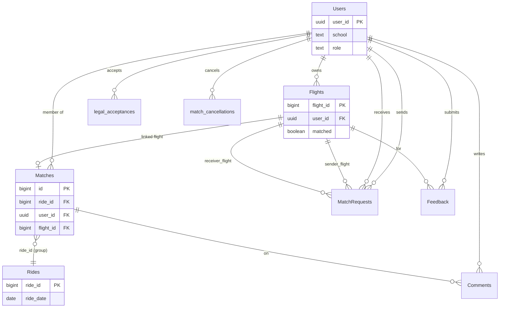

# Supabase schema reference

Human-readable catalog of the `public` schema used by PICKUP. Column types match [`src/lib/database.types.ts`](../src/lib/database.types.ts) (generated from Supabase). Regenerate types after schema changes — full steps in [OPERATIONS.md](./OPERATIONS.md):

```bash
pnpm exec supabase gen types typescript --linked --schema public > src/lib/database.types.ts
```

Alternative if not linked: `--project-id <ref>` instead of `--linked`.

**Note:** `ChangeLog.change_batch_id` is used in the app but may be missing from an older `database.types.ts` export—confirm in the Supabase table editor.

---

## Entity relationships



**Group model:** A **ride group** is all `Matches` rows sharing the same `ride_id`. Each row is one rider’s membership and stores per-rider voucher/subsidy fields; pickup **date/time** on `Matches` are the group schedule shown to users (often aligned across members).

---

## Storage (not in `database.types`)

| Bucket | Purpose |
|--------|---------|
| `profile_picture` | User-uploaded avatars (`Users.photo_url` points to public URL) |

---

## `Users`

One row per person; `user_id` = Supabase Auth user id.

| Column | Type | Definition |
|--------|------|------------|
| `user_id` | `uuid` | Primary key; same as `auth.users.id` |
| `firstname` | `text` | Legal/given name (required for flight submit) |
| `lastname` | `text` | Family name |
| `email` | `text` | Contact email (can be different from auth email) |
| `phonenumber` | `text` | Contact Phone number |
| `school` | `text` | Campus affiliation (e.g. Pomona); used for admin scope |
| `role` | `text` | `admin`, `super_admin`, or default student |
| `admin_scope` | `text` | For `admin`: limits which riders/groups they can edit (e.g. school) |
| `photo_url` | `text` | URL to avatar in `profile_picture` storage (not really used right now) |
| `instagram` | `text` | Optional handle |
| `sms_opt_in` | `boolean` | Whether user opted into SMS with ASPC |
| `created_at` | `timestamptz` | Profile row created |

---

## `Flights`

Trip questionnaire submission; one user can have multiple flights over time.

| Column | Type | Definition |
|--------|------|------------|
| `flight_id` | `bigint` | Primary key |
| `user_id` | `uuid` | Owner → `Users.user_id` |
| `to_airport` | `boolean` | `true` = campus → airport; `false` = airport → campus |
| `airport` | `text` | Airport code (e.g. LAX, ONT) |
| `date` | `date` | Primary travel date |
| `earliest_time` | `time` | Start of preferred window |
| `latest_time` | `time` | End of preferred window |
| `latest_date` | `date` | End date if window spans days |
| `bag_no` | `int` | Standard checked bags |
| `bag_no_large` | `int` | Oversize checked bags |
| `bag_no_personal` | `int` | Personal/carry-on items |
| `flight_no` | `int` | Airline flight number (required) |
| `airline_iata` | `text` | Airline code (required) |
| `terminal` | `text` | Terminal |
| `opt_in` | `boolean` | Included in unmatched page |
| `matched` | `boolean` | `true` when user is in a group (`Matches` exists) |
| `original_unmatched` | `boolean` | Was unmatched before manual/algorithm grouping |
| `max_dropoff` | `int` | Max extra dropoffs willing (not really used currently) |
| `max_price` | `int` | Max price willingness (not really used currently) |
| `unmatched_email_sent` | `boolean` | Unmatched outreach email already sent |
| `last_status` | `text` | Last flight-status API status |
| `last_arr_estimated_utc` | `timestamptz` | Last known arrival estimate (UTC) |
| `last_dep_estimated_utc` | `timestamptz` | Last known departure estimate (UTC) |
| `last_notified_at` | `timestamptz` | Last delay notification time |
| `last_notified_delay_min` | `int` | Delay minutes at last notification |
| `created_at` | `timestamptz` | Row created |

---

## `Matches`

Rider ↔ group membership. **Shared `ride_id`** = one carpool group.

| Column | Type | Definition |
|--------|------|------------|
| `id` | `bigint` | Primary key (match row id) |
| `ride_id` | `bigint` | Group id (links members; FK to `Rides.ride_id` in DB) |
| `user_id` | `uuid` | Rider → `Users.user_id` |
| `flight_id` | `bigint` | Rider’s flight → `Flights.flight_id` |
| `date` | `date` | Group pickup date (admin/algorithm set) |
| `time` | `time` | Group pickup time |
| `earliest_time` | `time` | Optional window start on match row |
| `latest_time` | `time` | Optional window end on match row |
| `voucher` | `text` | Primary Uber voucher URL (`https://r.uber.com/...`) |
| `contingency_voucher` | `text` | Backup voucher (for return trips) |
| `is_subsidized` | `boolean` | ASPC-subsidized ride |
| `subsidized_override` | `boolean` | Admin forced subsidy on/off |
| `uber_type` | `text` | Suggested product: `X`, `XL`, `XXL`, `Connect` |
| `uber_type_override` | `boolean` | Admin overrode vehicle size |
| `is_verified` | `boolean` | Optionally used for testing before sending batch match emails (have to change batch emails edge function to use with this)|
| `email_sent` | `boolean` | Match confirmation email sent |
| `source` | `text` | algorithm, manual, match request, etc. |
| `group_ready_at` | `timestamptz` | Set when all riders completed ASPC ready flow |
| `ready_for_pickup_at` | `timestamptz` | When this user marked ready at pickup |
| `ready_for_pickup_status` | `text` | `ready` or `reporting_missing` |
| `reported_missing_user_ids` | `uuid[]` | Users reported absent at pickup |
| `reason_for_delay` | `text` | Delay reason from ASPC delay flow |
| `created_at` | `timestamptz` | Row created |

---

## `Rides`

Group-level header (date/time/voucher at ride granularity). The frontend mostly reads/writes **`Matches`**; we added extra columns here for the future if ride characteristics (time, type, voucher, etc.) should be moved to this table instead of in `Matches`. Currently, all this info is stored in `Matches` and the query logic follows that.

| Column | Type | Definition |
|--------|------|------------|
| `ride_id` | `bigint` | Primary key (same id used on `Matches.ride_id`) |
| `ride_date` | `date` | Group date |
| `ride_time` | `time` | Group time (unused) |
| `ride_type` | `text` | Category label for the ride (unused)|
| `subsidized` | `boolean` | Ride-level subsidy flag (unused)|
| `voucher` | `text` | Ride-level voucher (may mirror match vouchers) (unused)|

---

## `MatchRequests`

Peer requests between unmatched travelers.

| Column | Type | Definition |
|--------|------|------------|
| `id` | `uuid` | Primary key |
| `sender_id` | `uuid` | User who sent request |
| `receiver_id` | `uuid` | User who receives request |
| `sender_flight_id` | `bigint` | Sender’s `Flights.flight_id` |
| `receiver_flight_id` | `bigint` | Receiver’s `Flights.flight_id` |
| `status` | `text` | `pending`, `accepted`, or `rejected` |
| `created_at` | `timestamptz` | Request created |

Accepting calls RPC `accept_match_request`, which creates/updates `Matches` and marks flights matched.

---

## `ChangeLog`

Audit trail for admin actions, algorithm runs, emails, and ASPC delay events.

| Column | Type | Definition |
|--------|------|------------|
| `id` | `uuid` | Primary key |
| `actor_user_id` | `uuid` | Who performed the action |
| `actor_role` | `text` | Role at time of action (e.g. Admin) |
| `action` | `text` | Event type (see list below) |
| `target_group_id` | `bigint` | Affected `ride_id`, if any |
| `target_user_id` | `uuid` | Affected user, if any |
| `metadata` | `jsonb` | Structured details (times, vouchers, flight ids, etc.) |
| `algorithm_run_id` | `text` | Links to matching run when relevant |
| `change_batch_id` | `uuid` | Groups multiple log lines from one admin operation |
| `confirmed` | `boolean` | Admin acknowledged a validation warning |
| `ignored_error` | `boolean` | Error was explicitly ignored |
| `created_at` | `timestamptz` | Event time |

**Common `action` values** (from app): `RUN_ALGORITHM`, `ADD_TO_GROUP`, `REMOVE_FROM_GROUP`, `CREATE_GROUP`, `DELETE_GROUP`, `UPDATE_GROUP_TIME`, `UPDATE_VOUCHER`, `UPDATE_RIDER_DETAILS`, `EMAIL_CONFIRMED`, `ADD_FLIGHT`, `ASPC_DELAY`, `IGNORE_ERROR`.

---

## `AlgorithmStatus`

Matching job lifecycle (admin dashboard).

| Column | Type | Definition |
|--------|------|------------|
| `id` | `uuid` | Primary key |
| `algorithm_name` | `text` | Which matcher ran |
| `status` | `text` | Run state (scheduled, running, completed, failed, etc.) |
| `target` | `text` | Scope or target description |
| `run_id` | `text` | External or internal run identifier |
| `scheduled_for` | `timestamptz` | When run was scheduled |
| `started_at` | `timestamptz` | Run start |
| `finished_at` | `timestamptz` | Run end |
| `error_message` | `text` | Failure details |
| `created_at` | `timestamptz` | Row created |

---

## `Comments`

Comments on a match or ride (results UI). People use this for messaging each other within their groups.

| Column | Type | Definition |
|--------|------|------------|
| `id` | `bigint` | Primary key |
| `user_id` | `uuid` | Author |
| `match_id` | `bigint` | Optional → `Matches.id` |
| `ride_id` | `bigint` | Optional group reference |
| `comment` | `text` | Body |
| `created_at` | `timestamptz` | Posted at |

---

## `Feedback`

Post-trip ratings.

| Column | Type | Definition |
|--------|------|------------|
| `feedback_id` | `bigint` | Primary key |
| `user_id` | `uuid` | Respondent |
| `flight_id` | `bigint` | Trip rated |
| `overall` | `int` | Overall score |
| `convenience` | `int` | Convenience score |
| `comments` | `text` | Free text |
| `created_at` | `timestamptz` | Submitted at |

---

## `legal_acceptances`

Terms / privacy acceptance log.

| Column | Type | Definition |
|--------|------|------------|
| `id` | `uuid` | Primary key |
| `user_id` | `uuid` | Who accepted |
| `terms_version` | `text` | Version string of legal docs |
| `action` | `text` | Context (e.g. new flight vs edit) |
| `accepted_at` | `timestamptz` | When accepted |

---

## `match_cancellations`

Recorded when users cancel a match (admin reporting / policy).

| Column | Type | Definition |
|--------|------|------------|
| `id` | `bigint` | Primary key |
| `user_id` | `uuid` | Who cancelled |
| `ride_id` | `bigint` | Group left |
| `flight_id` | `bigint` | Flight row |
| `airport` | `text` | Airport at time of cancel |
| `to_airport` | `boolean` | Direction |
| `match_date` | `date` | Scheduled group date |
| `match_time` | `time` | Scheduled group time |
| `is_subsidized` | `boolean` | Was subsidized |
| `cancellation_type` | `text` | Category (no-show, user cancel, etc.) |
| `reason` | `text` | User or system reason |
| `cancelled_at` | `timestamptz` | When cancelled |
| `cancelled_before_1hr` | `boolean` | Within 1 hour of pickup |
| `cancelled_after_deadline` | `boolean` | After policy deadline |

---

## Auth schema

Supabase **`auth.users`** holds login identity (Google OAuth). **`public.Users`** is the app profile; created/updated on first sign-in via `/auth/callback`. Find more information on Supabase Authentication.

---

## Related docs

- [SUPABASE.md](./SUPABASE.md) — RPCs, edge functions, syncing
- [PLATFORM_OVERVIEW.md](./PLATFORM_OVERVIEW.md) — how tables fit the product flow
